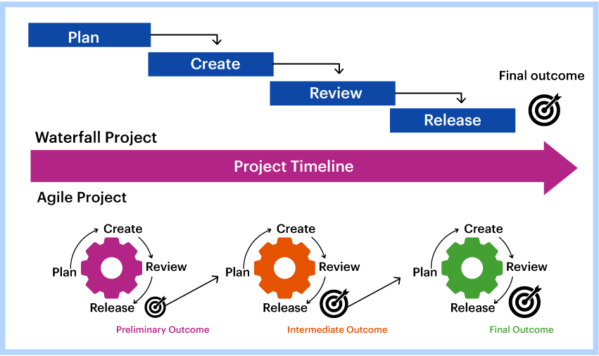
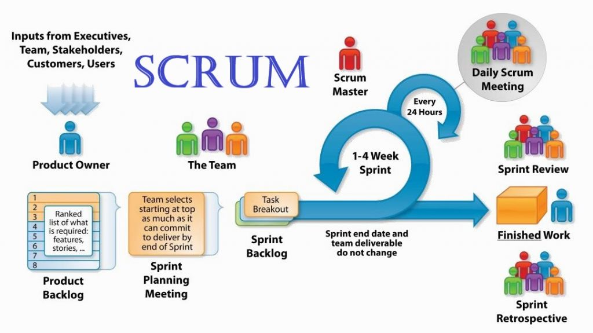
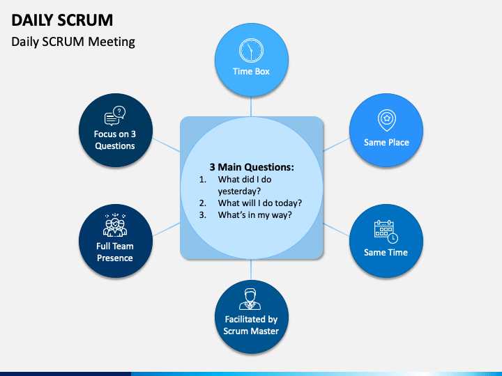

# tech201_agile_and_scrum
tech201_agile_and_scrum

Agile v Waterfall

What is the difference between Agile and traditional models?

What are scrum artifacts?

Scrum Team.

How Can We Effectively Gather Requirements?

